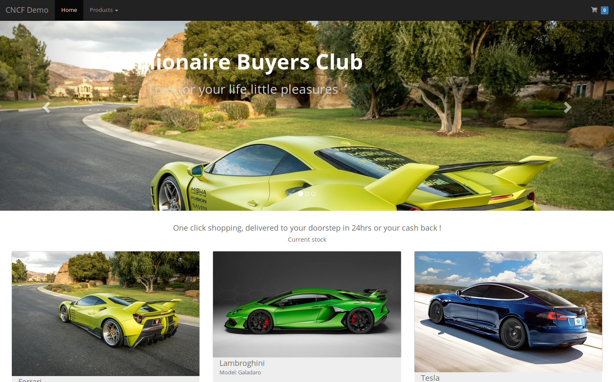

Simple eCommerce Demo in Angularjs
==================================

This repo is a sample ecommerce demo

Clone the repo
==============

Clone it !

    git clone https://github.com/olsc-devops/bbc cncfdemo

Requirements
============

You need to install nodejs from your yum (or whatever) repo, or directly from https://nodejs.org. After cloning this git repo you will need
to run 

    npm install

The intertpreter in my .js scripts (populate.js and buy.js) assume the "node" binary is in installed in /usr/bin. So you can either edit those
scripts of just prepend the script with the node interpreter.

Loading items into the shop
===========================

There are 3 steps to populating the shop:

      1. Adding images for the shop items (sock, cars, t-shirts, etc)
      2. Loading descriptions for those items into the database
      3. Stocking the items in the database (by default your stock is 0 - you can list the items but it will
         show your inventory as "out of stock")

Adding images for your items
============================

This is the easy bit. Just find and copy images to the frontend directory fe/img. Preferaby choose some landscape high-res
images. Take note of copyright infringement (i.e. don't infringe)

Loading descriptions for your items
===================================

Create a file in json format and load this into the database. Any older database items will not wiped. Some sample json file
are included in "*.json". You can populate the database using (assuming your env is pointing to a mongodb instance
like MONGODB=mongodb://localhost/cncfdemo as deployed in my full-stack-cncf-demo)

       $ node populate.js ./cars.json

A random set of item images in the json file will be rotated in a carousel in the main page.

Stocking your shop
==================

You should add a "stockcount" item in the json file (defaults to 0) or use the restock api to randomly stock your items

    $ curl host:port/api/restock

You can also go to the URL /internal/admin and click the button to do this graphically

Changing the shop text title/caption/etc or language
====================================================

If you just want to change the text from the default cars specific messages, please edit the file

    fe/lang/messages_en.json

to whatever you choose.

If you like to change language, copy the file and rename the "en" to "es" if you want Spanish for example

    fe/lang/messages_es.json

and then use

    ENV LANG es

in your environment or the Dockerfile before building the container.

Sales stats
===========

Sales stats are available on a webpage on the URL /internal/sales or via the API with prometheus polling
the REST API on http://host:port/api/sales

Starting the app
=================

You need node and mongo installed somewhere. If you are using my infrastructure with virtualbox on github (full-stack-cncf-demo)
then you already have already mongodb and node installed, so just login as "demo" on "devnode" (192.168.56.200) and git clone the repo
and start the app by running

    bin/run.sh

but you would need to edit that file to point to your mongodb instance. If you want the app to listen to a different port than the default
4000, then just run

    bin/run.sh 80

Load generation
===============

There is a small included script to randomly purchase items from your shop. You can run this in a crontab or shell script to generate load or sales
stats for prometheus for customer demos graphing. You can run it with

    ./buy.js http://ip:port

You may need to run (once only)

    npm install

again if you pulled this repo after the package.json was updated and if you get an error when running the script.

For kubernetes you can spin a bunch of these short lived containers to "buy" stuff off the store to simulate load and generate stats. You
will need to edit the Dockerfile in the next section to set the ENTRYPOINT to this command

Docker/Kubernetes
=================

A Dockerfile is included in this repo. You may need to change the MONGODB and listening port in the Dockerfile before you build the container

    docker build -t cncfdemo .

You can test the app by

    docker run cncfdemo

and go to the container ip/host and port to see your shop.

Metrics
=======

I have created a metrics provider to expose sales metrics from the app. Assuming you MONGODB environment variable is set to the correct mongodb
for the app, you can just do

    export MONGODB=mongodb://localhost/cncfdemo
    ./metrics.js 4444

where 4444 is a port of your choice. You can  get metrics by reading the /metrics url

     curl http://localhost:4444/metrics

and attach appropriate prometheus monitoring/alerting and grafana dashboards to it.

Things to do
============

* Move the static images off the container using the CSI storage plugin with a PV/PVC on kubernetes
* Decouple frontend and backend so we can show independent scaling of fe/be
* Make API language independent so the backend can be written in the language of your choice (Oracle's fnproject.io)

Questions & Feedback
====================
Please contact me mitch.dsouza@oracle.com